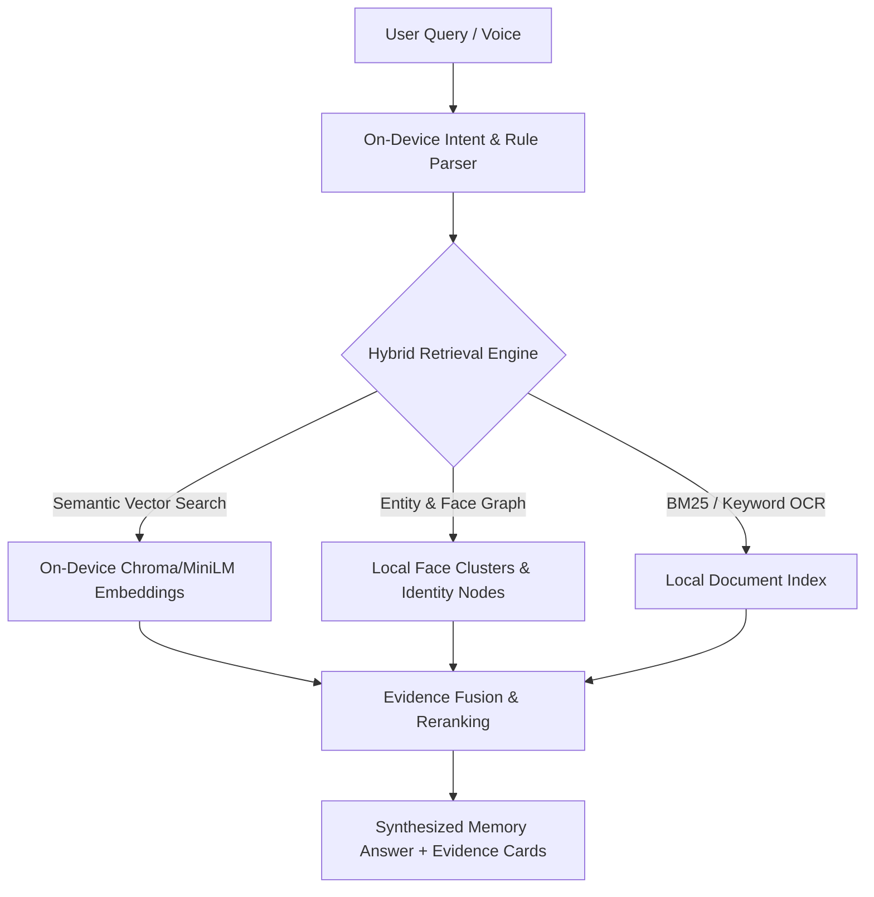

# 🧠 MEMORY | iQOO On-Device Personal Memory Layer

<div align="center">

[](https://iqoomemory.vercel.app)


**"YOUR PHONE REMEMBERS. YOU JUST HAVE TO ASK."**

*A zero-telemetry, on-device semantic memory engine engineered for iQOO OriginOS.*

**🌐 Live Demo:** [https://iqoomemory.vercel.app](https://iqoomemory.vercel.app)

</div>

---

## ⚡ Overview

**MEMORY** solves the modern smartphone fragmentation problem: users take thousands of photos, download dozens of resumes and receipts, and chat across multiple apps, but cannot retrieve information naturally without remembering exact file names or scrolling through endless galleries.

Built for the **iQOO 2026 Chennai City Battles Hackathon**, MEMORY indexes personal documents (PDFs, text) and photos (faces, places, visual tags) completely **on-device** using local vector embeddings, facial clustering, and lightweight semantic matching.

---

## ✨ Key Features

- **🔍 Multi-Modal Semantic Search**: Search across both documents and images with natural conversational queries (e.g., *"Show me photos of Prithiv"*, *"Find my software engineering resume"*).
- **👤 On-Device Face Recognition & Clustering**: Recognizes faces across personal photo memories without sending biometric data to the cloud.
- **📍 Geo-Spatial & Landmark Awareness**: Links memories to geographic nodes and landmarks (e.g., Marina Beach, CIT Campus).
- **🛡️ 100% Offline & Airplane Mode Ready**: Full search, retrieval, and synthesis operate locally with zero cloud telemetry.
- **⚡ Micro-Sleek OriginOS Aesthetic**: Ultra-compact flagship dark design with electric yellow accents (`#FFDE00`), micro-badges, and claymorphic card hierarchy.

---

## 🛠️ Architecture



---

## 🚀 Getting Started

### 1. Clone the Repository
```bash
git clone https://github.com/nevan-sonic/iqoomemory.git
cd iqoomemory
```

### 2. Install Dependencies
```bash
npm install
```

### 3. Run the Development Server
```bash
npm run dev
```
Open **`http://localhost:3000`** in your browser.

### 4. Run Automated Verification Tests
```bash
node test_memory_system.js
```

---

## 🧪 Demo Test Queries

| # | Query | Expected Retrieval | Target Engine |
|---|---|---|---|
| 1 | *"Show me photos of Prithiv"* | `friend.jpeg` | Face Recognition & Identity Matching |
| 2 | *"Photos at Marina Beach"* | `beach.jpeg` | Geo-Coordinate & Landmark Matching |
| 3 | *"Find my software engineering resume"* | `Nevan_July_Resume.pdf` | Document Vector & OCR Text Search |
| 4 | *"Find Prithiv's resume"* | `PrithivR Resume.pdf` | Named Entity & Resume Matching |
| 5 | *"Photos of friend in orange shirt"* | `friend.jpeg` | Visual Feature & Color Tag Matching |
| 6 | *"Photos of my dog at Eiffel Tower"* | `0 results` | Honest Negative Query Filtering |

---

## 👥 Authors & Credits

- **Nevan R G** ([@nevan-sonic](https://github.com/nevan-sonic)) — *AI/ML Engineer*
- **Submission for iQOO Chennai City Battles Hackathon 2026**
